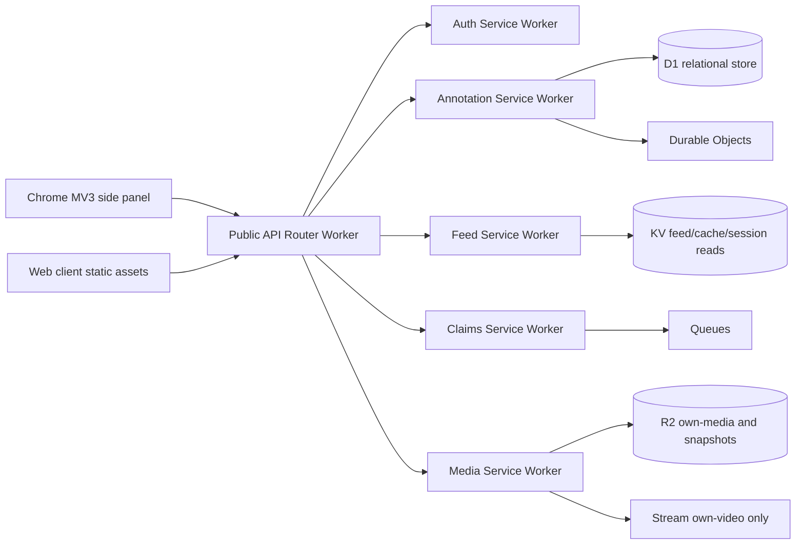

# Cloudflare Architecture Draft

The public API should be a thin HTTP router that authenticates, validates, applies cross-cutting policies, and dispatches to internal Cloudflare services. Internal services can be separate Workers connected through Service bindings so the public API shape stays stable while the backend evolves.

## High-Level Topology



## Service Responsibilities

| Service | Responsibility | Primary Cloudflare primitives |
| --- | --- | --- |
| API Router Worker | Public REST boundary, auth check, validation, rate limits, response envelope. | Workers, Service bindings, Static Assets routing |
| Auth Service | OAuth provider state, sessions, extension token exchange. | Workers, KV, D1 |
| Annotation Service | Clip validation, annotation persistence, permalink payloads. | Workers, D1, Queues |
| Feed Service | Feed reads, fan-out materialization, profile lists. | Workers, KV, D1, Queues |
| Engagement Service | Likes, reposts, discussion counters, hot count coordination. | Workers, Durable Objects, D1 |
| Claims Service | Claim intake, event log, notifications, moderation state. | Workers, D1, Queues |
| Media Service | User-owned audio/video upload intents and metadata. | Workers, R2, Stream |

## Data Stores

### D1

Use D1 for relational system-of-record tables:

- `users`
- `oauth_accounts`
- `sessions`
- `sources`
- `clips`
- `annotations`
- `follows`
- `engagement_events`
- `claims`
- `claim_events`
- `queue_idempotency_keys`

Core relational constraints:

- `sources.source_url` is `NOT NULL`.
- `clips.source_id` is required for third-party clips.
- `annotations.author_id`, `annotations.clip_id`, and `annotations.visibility` are required.
- Unique idempotency keys for publish, claim, and engagement mutations.

### KV

Use KV for read-heavy, eventually consistent data:

- OAuth state and short-lived extension handoff state.
- Cached feed pages.
- Public profile snippets.
- Feature flags and non-sensitive configuration.

Do not use KV as the source of truth for follows, claims, or publish operations.

### Queues

Use Queues for background work:

- Feed fan-out or cache invalidation.
- Claim notification.
- OG metadata fetch and refresh.
- Optional source-page snapshot.
- Post-publish analytics events.

Consumers must be idempotent. Queue messages should carry a stable `job_id` or domain idempotency key.

### Durable Objects

Use Durable Objects only where coordination is required:

- Per-annotation engagement counters.
- Real-time discussion or feed update channels.
- Per-user publish throttles if needed.

Avoid a single global Durable Object. Model each object around the smallest coordination atom, such as `annotation:{id}`.

### R2 and Stream

- R2 stores user-owned audio commentary, generated OG images, and optional source-page snapshots.
- Stream stores only user-owned video uploads.
- Third-party clips from YouTube/news/podcast pages remain references and should not be copied or transcoded.

## Routing Model

The public Worker should use Workers Static Assets for the web client and `run_worker_first` for `/api/*`. Internal calls should use Service bindings instead of public HTTP between Workers.

Suggested bindings:

```json
{
  "services": [
    { "binding": "AUTH_SERVICE", "service": "annotated-auth" },
    { "binding": "ANNOTATION_SERVICE", "service": "annotated-annotation" },
    { "binding": "FEED_SERVICE", "service": "annotated-feed" },
    { "binding": "CLAIMS_SERVICE", "service": "annotated-claims" },
    { "binding": "MEDIA_SERVICE", "service": "annotated-media" }
  ]
}
```

## Request Flow Examples

### Publish Annotation

1. Extension sends `POST /api/annotations` with an idempotency key.
2. API Router validates session, source URL, clip shape, and max duration.
3. Annotation Service writes source, clip, and annotation rows in D1.
4. Annotation Service enqueues feed fan-out and metadata jobs.
5. Engagement Durable Object initializes the annotation counter lazily on first engagement.

### File Claim

1. Web client sends `POST /api/claims` from permalink page.
2. API Router verifies the target annotation exists and normalizes claimant fields.
3. Claims Service writes `claims` and `claim_events`.
4. Queue sends notifications and moderation tasks.
5. Permalink reads show current claim status without removing content unless moderation state changes.

## Observability and Safety

- Use structured logs with `request_id`, `user_id`, `annotation_id`, and `job_id`.
- Enable Workers Logs with sampling tuned per environment.
- Track queue retry and dead-letter counts.
- Rate-limit publish, claim filing, and engagement mutation endpoints.
- Create explicit moderation states: `open`, `needs_info`, `accepted`, `rejected`, `withdrawn`.

## Deployment Control Plane

Production deployment is owned by GitHub Actions, not local laptops. The ordered path is `verify`, `cloudflare_production_preflight`, then `deploy-production` against the GitHub `production` environment. The preflight job makes skipped deployments visible when `CLOUDFLARE_DEPLOY_ENABLED` is not `true`; the production job repeats credential preflight after environment approval so missing Cloudflare secrets fail before D1 migrations, Worker deploy, or Pages deploy can mutate production.

Local Wrangler remains a guarded fallback for resource bootstrap and emergency deploys. The fallback must use the same `apps/api/wrangler.production.jsonc` config and should not bypass the documented GitHub environment secret setup for normal releases.

## Architecture Sources

- Cloudflare Workers Static Assets: https://developers.cloudflare.com/workers/static-assets/
- Cloudflare Service bindings: https://developers.cloudflare.com/workers/runtime-apis/bindings/service-bindings/
- Cloudflare D1: https://developers.cloudflare.com/d1/
- Cloudflare Workers KV: https://developers.cloudflare.com/kv/
- Cloudflare Queues delivery guarantees: https://developers.cloudflare.com/queues/reference/delivery-guarantees/
- Cloudflare Durable Objects rules: https://developers.cloudflare.com/durable-objects/best-practices/rules-of-durable-objects/
- Cloudflare R2: https://developers.cloudflare.com/r2/how-r2-works/
- Cloudflare Stream direct creator uploads: https://developers.cloudflare.com/stream/uploading-videos/direct-creator-uploads/
